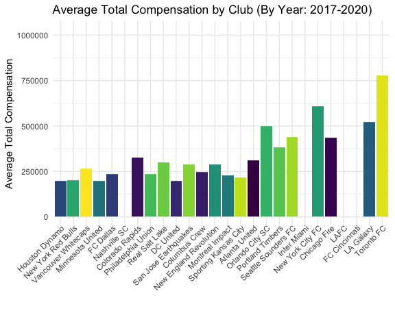
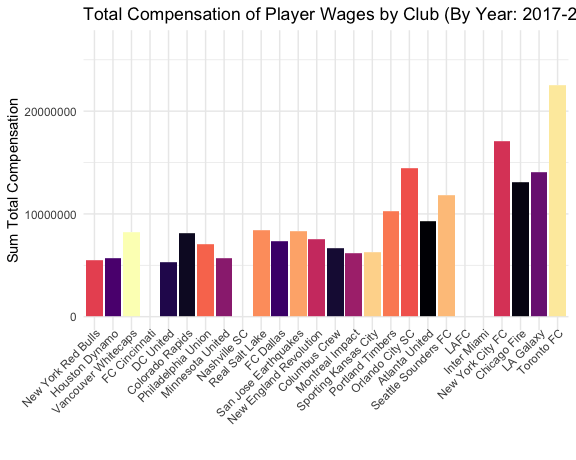

```{r setup, include=FALSE, message=FALSE, warning=FALSE}
library(flexdashboard)
library(tidyverse)
library(rio)
library(gt)
library(here)
library(psych)
library(stringi)
library(ggpubr)
library(DT)
library(readxl)
library(plotly)
library(forcats)
library(ggthemes)
library(gganimate)
library(gifski)
library(countrycode)

# Importing the original dataset
MLS_GK <- import(here("Data/MLS/all_goalkeepers.csv"))
MLS_Players <- import(here("Data/MLS/all_players.csv"))


# All players that had at least 1 minute of game time
Active_Players <- MLS_Players %>%
  filter(MINS != 0)

Active_Players$Player <- stri_trans_general(Active_Players$Player, id = "Latin-ASCII")

Active_Players$Player <- gsub("-", "", Active_Players$Player)


# As the name states. Goalkeepers with more than one minute of game time.
Active_Gk <- MLS_GK %>%
  filter(MINS != 0)

Active_Gk$Player <- stri_trans_general(Active_Gk$Player, id = "Latin-ASCII")

Active_Gk$Player <- gsub("-", "", Active_Gk$Player)

###############################################################################

# Weird, there is no club with the abbreviation LFC in the MLS. I looked into it and it looks like it is actually meant to be LAFC. So I will mutate the cases of LFC to LAFC.

Active_Players$Club <-replace(Active_Players$Club, Active_Players$Club == "LFC", "LAFC")
Active_Players$Club <-replace(Active_Players$Club, Active_Players$Club == "NY", "NYC")
Active_Players$Club <-replace(Active_Players$Club, Active_Players$Club == "MCF", "MTL")

################################################################################

# Let's change the Position to factors. 
Active_Players$POS <- as.factor(Active_Players$POS)
Active_Players$Club <- as.factor(Active_Players$Club)

###############################################################################

### Need to merge GK and Player data-sets for salary
MLS_Players17_20 <- MLS_Players %>% filter(Year == 2017 | Year == 2018 | Year == 2019 | Year == 2020)

MLS_Players17_20 <- MLS_Players17_20 %>% select(-c("Club","GWG", "PKG/A", "GWA"))

MLS_GK17_20 <- MLS_GK %>% filter(Year == 2017 | Year == 2018 | Year == 2019 | Year == 2020)

MLS_GK17_20 <- MLS_GK17_20 %>% select(-c("Club", "PKG/A", "W", "L", "T", "W%"))


Players_all_17_20 <- merge(MLS_Players17_20, MLS_GK17_20, by = c("Player", "POS", "MINS","GP", "GS", "Year", "Season"), all = TRUE)

Players_all_17_20$Player <- stri_trans_general(Players_all_17_20$Player, id = "Latin-ASCII")

Players_all_17_20$Player <- gsub("-", "", Players_all_17_20$Player)

###############################################################################


### Reading in the 2019 player salaries
sal_19 <- read_xlsx(here("Data/Salary 19.xlsx"), skip = 1)

### Adjusting the column names
fix <- c(Base_Salary_19 = "Base Salary 19", Total_Comp_19 = "Base Guaranteed Comp 19")
sal_19 <- rename(sal_19, all_of(fix))

### Combining first and last name to create a combined player name
sal_19$Player <- apply(sal_19[, c("First Name", "Last Name")], 1,
                      function(i){ paste(na.omit(i), collapse = " ") })

### Removing accents from names as the original list to merge to does not have accents
sal_19$Player <- stri_trans_general(sal_19$Player, id = "Latin-ASCII")

### Removing hyphens between names
sal_19$Player <- gsub("-", "", sal_19$Player)

### Selecting only club, salary, and name
sal_19 <- sal_19 %>% select(c("Club", "Base_Salary_19", "Total_Comp_19", "Player"))

# 2019 Salaries are in, but let's add in 2017, 2018, and 2020
###############################################################################
### Importing and cleaning 2017 salaries
sal_17 <- read_xlsx(here("Data/Salary 17.xlsx"), skip = 1, col_names = TRUE)
### Fixing weird spacing in the name column that caused errors
fix <- c(First_Name = "First Name", Last_Name = "Last Name", Base_Salary_17 = "Base Salary", Total_Comp_17 = "Compensation")
sal_17 <- rename(sal_17, all_of(fix))

### Combining first and last name while ignoring NAs
sal_17$Player <- apply(sal_17[, c("First_Name", "Last_Name")], 1,
                      function(i){ paste(na.omit(i), collapse = " ") })

### Removing any accent marks in names to combine with existing data
sal_17$Player <- stri_trans_general(sal_17$Player, id = "Latin-ASCII")

### Remove dash from names to match with original data
sal_17$Player <- gsub("-", "", sal_17$Player)

### Selecting only club, salary, and name
sal_17 <- sal_17 %>% select(c("Club", "Base_Salary_17", "Total_Comp_17", "Player"))


###############################################################################
### Importing 2018 player salaries
sal_18 <- read_xlsx(here("Data/Salary 18.xlsx"))

### Fixing column names
fix <- c(First_Name = "First Name", Last_Name = "Last Name", Base_Salary_18 = "Salary ", Total_Comp_18 = "Compensation ")
sal_18 <- rename(sal_18, all_of(fix))

sal_18$Player <- apply(sal_18[, c("First_Name", "Last_Name")], 1,
                      function(i){ paste(na.omit(i), collapse = " ") })

### Removing any accent marks in names to combine with existing data
sal_18$Player <- stri_trans_general(sal_18$Player, id = "Latin-ASCII")

### Remove dash from names to match original data
sal_18$Player <- gsub("-", "", sal_18$Player)

### Selecting only club, salary, and name
sal_18 <- sal_18 %>% select(c("Club", "Base_Salary_18", "Total_Comp_18", "Player"))

### Changing the salary to numeric from character
sal_18$Base_Salary_18 <- as.numeric(sal_18$Base_Salary_18)

sal_18$Total_Comp_18 <- as.numeric(sal_18$Total_Comp_18)


###############################################################################
### Importing 2020 Player salaries
sal_20 <- read_xlsx(here("Data/Salary 20.xlsx"))

fix <- c(Base_Salary_20 = "Base Salary 20", Total_Comp_20 = "Base Guaranteed Comp 20")
sal_20 <- rename(sal_20, all_of(fix))

sal_20$Player <- apply(sal_20[, c("First Name", "Last Name")], 1,
                      function(i){ paste(na.omit(i), collapse = " ") })

sal_20$Player <- stri_trans_general(sal_20$Player, id = "Latin-ASCII")

sal_20 <- sal_20 %>% select(-contains('...6'))

### Remove dash from names to match original data
sal_20$Player <- gsub("-", "", sal_20$Player)

### Selecting only club, salary, and name
sal_20 <- sal_20 %>% select(c("Club", "Base_Salary_20", "Total_Comp_20", "Player"))


###############################################################################
# I am sure there is a better way but I don't know how
### Combining 2017 and 2018 data
Salaries <- merge(sal_17, sal_18, by = "Player", all = TRUE)

### Fixing the club column names
fix <- c(Club_17 = "Club.x", Club_18 = "Club.y")
Salaries <- rename(Salaries, all_of(fix))

### Adding in the 2019 salaries
Salaries <- merge(Salaries, sal_19, by = "Player", all = TRUE)

### Adding in the 2020 salaries
Salaries <- merge(Salaries, sal_20, by = "Player", all = TRUE)

### Fixing the club column names again
fix <- c(Club_19 = "Club.x", Club_20 = "Club.y")
Salaries <- rename(Salaries, all_of(fix))

### Selecting just the club information
Player_Club <- Salaries %>% select("Player", "Club_17", "Club_18", "Club_19", "Club_20")

### Making the club data longer
Player_Club_long <- Player_Club %>% pivot_longer(cols  = -Player, names_to = c("Club", "Year"), 
    names_sep = "\\.")

### Separating the club column by year
Player_Club_long <- Player_Club_long %>%
  separate(Club, c('Club', 'Year'), sep = "(.*)_()")

### Adding 20 infront of the years
Player_Club_long$Year <- sub("^", "20", Player_Club_long$Year)

### Making year numeric
Player_Club_long$Year <- as.numeric(Player_Club_long$Year)

### selecting only a few columns
Player_Club_long <- Player_Club_long %>% select("Player", "Year", "value")

### Changing the column name to club
Player_Club_long <- rename(Player_Club_long, Club = "value")

### Removing players with NA values for club meaning they did not play in the league that year
Player_Club_long <- Player_Club_long %>% filter(Club != "NA")

#################################################################

### Salaries needs to be in long format in order to be merged 
### Selecting just the salary data
Salaries_long <- Salaries %>% select("Player", "Base_Salary_17", "Total_Comp_17", "Base_Salary_18", "Total_Comp_18", "Base_Salary_19", "Total_Comp_19", "Base_Salary_20", "Total_Comp_20")

### pivoting longer by salary type
Salaries_long <- Salaries_long %>% pivot_longer(cols  = -Player, names_to = c("Salary", "Year"), 
    names_sep = "\\.")

### separating column by year
Salaries_long <- Salaries_long %>%
  separate(Salary, c('Salary', 'Year'), sep = "()_(.*)_()")

### adding 20 in front of years to make it match with original data
Salaries_long$Year <- sub("^", "20", Salaries_long$Year)

### Making year numeric
Salaries_long$Year <- as.numeric(Salaries_long$Year)


  
###############################################################################

### Combining the salaries into the active players list by Player name
Players_all_17_20 <- left_join(Players_all_17_20, Salaries_long, by = c("Player", "Year"))


### Simplifying the position factor to three variables
Players_all_17_20$POS <- fct_collapse(Players_all_17_20$POS, M = c("M","M-F", "M-D"), D = c("D","D-M"), F = c("F-M", "F"), Gk = "GK")

### Finally I need to rename some columns
fix <- c(Games = "GP", Starts = "GS", Goals = "G", Assists = "A", Shots = "SHTS.x", `Shots On Goal` = "SOG", `Home Goals` = "HmG", `Away Goals` = "RdG", `Goals/90` = "G/90min", `Home Assists` = "HmA", `Away Assists` = "RdA", `Scoring Percent` = "SC%", `Assists/90` = "A/90min", Fouls= "FC", `Fouls Suffered` = "FS", Offsides = "OFF", `Yellow Cards` = "YC", `Red Cards` = "RC", `Shots Faced` = "SHTS.y", Saves = "SV", `Goals Against` = "GA", `Goals Against Avg` = "GAA", Shoutouts = "ShO", `Save Pct` = "Sv%")
Players_all_17_20 <- rename(Players_all_17_20, all_of(fix))


# Now, I need to add in the correct club information because in this review I realized that the club info in the original dataset was incorrect. To do this I am going to remove the Club column and merge in the player club dataset I took from the player salaries.

Players_all_17_20 <- left_join(Players_all_17_20, Player_Club_long, by = c("Player", "Year"))


###############################################################################

# I realized I need to pivot the salary data into a wider format

Players_all_17_20 <- Players_all_17_20 %>%
  pivot_wider(
    names_from = Salary,
    values_from = value)

### For some reason there is a weird empty column now. I am sure I probably pivoted incorrectly, but I am just going to delete the extra column because that seems easier since I have the data in the right place

Players_all_17_20 <- Players_all_17_20 %>% select(-c("NA"))

fix <- c(`Base Salary` = "Base", `Total Comp` = "Total")
Players_all_17_20 <- rename(Players_all_17_20, all_of(fix))

# Much cleaner!


#####################################################################

# I am still deciding if I need/want to include percent change in salary

### Adding in salary change amount
Players_all_17_20$Difference <- (Players_all_17_20$`Total Comp`-Players_all_17_20$`Base Salary`)

### Adding salary percent change by season
Players_all_17_20$Pct_Difference <- round(((Players_all_17_20$Difference)/(Players_all_17_20$`Total Comp`))*100,digits=2)

### Creating a subset of regular season games
Players_all_17_20_Reg <- Players_all_17_20 %>%
  filter(Season == "reg")

##############################################################################

### Data from Fbref on 2020 player data and nationality
# Importing
Nation_20 <- import(here("Data/2020_player_nation_sal.csv"))

# Removing the wages data because I already have this data and there are discrepancies
Nation_20 <- Nation_20 %>% select(-c("Weekly Wages", "Annual Wages"))

# From homework 4, getting the country codes
country_codes <- countrycode::codelist %>% 
  filter(ecb != 'NA') %>%
  select(country_name = country.name.en, country = ecb) 

# making the country codes lower case because I need to match with Nation_20
country_codes$country <- str_to_lower(country_codes$country)

# Merging together to get country names
Nation_20 <- merge(Nation_20, country_codes, by =  "country")

# Remvoing accent marks from names to make merging easier
Nation_20$Player <- stri_trans_general(Nation_20$Player, id = "Latin-ASCII")

### Remove dash from names to match original data
Nation_20$Player <- gsub("-", "", Nation_20$Player)


### Merging but I need to figure out how to merge year so that it does not delete the 2017 data.
Players_all_17_20_Reg_Nation <- merge(Players_all_17_20_Reg, Nation_20, by = c("Player", "Year"), all = TRUE)

### Removing duplicate column and empty column
Players_all_17_20_Reg_Nation <- Players_all_17_20_Reg_Nation %>% select(-c("V9"))

##############################################################

## Creating a column by country count
Players_all_17_20_Reg_Nation <- Players_all_17_20_Reg_Nation %>%
  group_by(country, Year) %>%
  add_count(country)

## average compensation
Players_all_17_20_Reg_Nation <- Players_all_17_20_Reg_Nation %>%
  group_by(country) %>%
  mutate(country_comp = mean(`Total Comp`, na.rm = TRUE))

## average minutes
Players_all_17_20_Reg_Nation <- Players_all_17_20_Reg_Nation %>%
  group_by(country) %>%
  mutate(country_mins = mean(MINS, na.rm = TRUE))


############################################################################

Player_Nation_freq <- Players_all_17_20_Reg_Nation %>%
  filter(Club != "Major League Soccer" | Club != "NA" | Club != "Retired") %>%
  group_by(Year, Nation, Club) %>%
  count(Nation, country_name)


Player_Nation_freq_table <- Player_Nation_freq %>% 
 pivot_wider(names_from = Nation, 
             values_from = n)

Player_Nation_freq_table <- Player_Nation_freq_table %>%
  select(-c(79, 82, 101:107))


# Let me try collapsing some of these.. 
# Let's change the club to a factor 
Player_Nation_freq$Club <- as.factor(Player_Nation_freq$Club)

# This is questionable as it acutally eliminates a decent chunk of players who have no nationality data.
Player_Nation_freq <- Player_Nation_freq %>%
  filter(country_name != "NA")

# I was going to do the tedious task of collapsing factors but then I realized that the country code data probably had the continent data as well. Luckily it did.
## Taking the names of countries
countrycodes <- data.frame(country_codes$country_name)

## Assigning continent by country name
country_codes$continent <- countrycode(sourcevar = countrycodes[, "country_codes.country_name"],
                            origin = "country.name",
                            destination = "continent")

## Merging the dataset
Player_Nation_freq <- merge(Player_Nation_freq, country_codes, by = "country_name")

Players_all_17_20_Reg_Nation<- merge(Players_all_17_20_Reg_Nation, country_codes, by = "country_name")

Player_Nation_freq <- Players_all_17_20_Reg_Nation %>%
  filter(Club != "Major League Soccer" | Club != "NA" | Club != "Retired") %>%
  group_by(Year, continent, Club) %>%
  count(continent)


## Assigning region by country name
country_codes$region <- countrycode(sourcevar = countrycodes[, "country_codes.country_name"],
                            origin = "country.name",
                            destination = "region")

Players_all_17_20_Reg_Nation<- merge(Players_all_17_20_Reg_Nation, country_codes, by = "country_name")

Player_Nation_freq <- Players_all_17_20_Reg_Nation %>%
  filter(Club != "Major League Soccer" | Club != "NA" | Club != "Retired") %>%
  group_by(Year, region, Club) %>%
  count(region)

```


Club Overview
=======================================================================

Row {data-height=500}
----------------------------------------------------------------------

### Club Average Salary Spend by Year (2017-2020)

```{r message=FALSE, warning=FALSE, results = F}

Club_spend_plot <- Players_all_17_20_Reg %>%
  filter(Club != "Retired" & Club != "Major League Soccer") %>%
  group_by(Year, Club) %>%
  summarize(Club_avg = mean(`Total Comp`)) %>%
  ggplot(aes(x = Club_avg, y = reorder(Club, Club_avg))) +
  geom_col(aes(fill = Club), position = "dodge", show.legend = FALSE) +
  theme_minimal() +
  scale_fill_viridis_d() +
  coord_flip() +
  labs(x = "Average Total Compensation", y = "", title = "Average Total Compensation by Club (By Year: 2017-2020)") +
  theme(axis.text.x = element_text(angle = 45, vjust = 1.1, hjust = 1)) +
  transition_time(Year)

anim_save("Club_spend.gif", Club_spend_plot)

```


### Club Total Salary Spend by Year (2017-2020)

```{r, message=FALSE, warning=FALSE, results=F}

options(scipen = 999)

sal_sum_plot <- Players_all_17_20_Reg %>%
  filter(Club != "Retired" & Club != "Major League Soccer") %>%
  group_by(Year, Club) %>%
  summarize(Club_sum = sum(`Total Comp`)) %>%
  ggplot(aes(x = Club_sum, y = reorder(Club, Club_sum))) +
  geom_col(aes(fill = Club), position = "dodge", show.legend = FALSE) +
  theme_minimal() +
  scale_fill_viridis_d(option = "magma") +
  coord_flip() +
  labs(x = "Sum Total Compensation", y = "", title = "Total Compensation of Player Wages by Club (By Year: 2017-2020)") +
  theme(axis.text.x = element_text(angle = 45, vjust = 1.1, hjust = 1))+
  transition_time(Year)

anim_save("Club_sum.gif", sal_sum_plot)


```


Row {data-height=600}
-----------------------------------------------------------------------

### Net Salary Spend by Club (2017-2020) 

```{r, fig.height=8, fig.width=12}
Players_all_17_20_Reg %>%
  filter(Club != "Retired" & Club != "Major League Soccer") %>%
  group_by(Club) %>%
  summarize(Club_sum = sum(`Total Comp`)) %>%
  ggplot(aes(x = Club_sum, y = reorder(Club, Club_sum))) +
  geom_col(aes(fill = Club), position = "dodge", show.legend = FALSE) +
  theme_minimal() +
  scale_fill_viridis_d() +
  coord_flip() +
  labs(x = "Total Wages", y = "", "Total ", title = "Total wages across years by Club") +
  theme(axis.text.x = element_text(angle = 45, vjust = 1.1, hjust = 1))

```

Row {data-height=400}
-----------------------------------------------------------------------

### Active Players 2020 {.no-padding}

```{r}
Active_Players %>%
  filter(Year == 2020, Club != "")%>%
  count(Club) %>%
  mutate(Club = fct_reorder(Club, desc(n))) %>%
  ggplot()+
  geom_col(aes(x = n, y = Club, fill = Club), show.legend = FALSE)+
  theme_minimal()+
  labs(x = "Number of Players", y = "", title="Active Players by Team in 2020")+
  scale_x_continuous(name="Number of Active Field Players", breaks=seq(0,30,3))+
  scale_fill_viridis_d()
```

### Active Players 2019 {.no-padding}

```{r}
Active_Players %>%
  filter(Year == 2019, Club != "")%>%
  count(Club) %>%
  mutate(Club = fct_reorder(Club, desc(n))) %>%
  ggplot()+
  geom_col(aes(x = n, y = Club, fill = Club), show.legend = FALSE)+
  theme_minimal()+
  labs(x = "Number of Players", y = "", title="Active Players by Team in 2019")+
  scale_x_continuous(name="Number of Active Field Players", breaks=seq(0,30,3))+
  scale_fill_viridis_d()


```


Row {data-height=400}
-----------------------------------------------------------------------

### Active Players by team in 2018

```{r}
Active_Players %>%
  filter(Year == 2018, Club != "" & Club != "NSH" & Club != "MIA" & Club != "CIN")%>%
  count(Club) %>%
  mutate(Club = fct_reorder(Club, desc(n))) %>%
  ggplot()+
  geom_col(aes(x = n, y = Club, fill = Club), show.legend = FALSE)+
  theme_minimal()+
  labs(x = "Number of Players", y = "", title="Active Players by Team in 2018")+
  scale_x_continuous(name="Number of Active Field Players", breaks=seq(0,30,3))+
  scale_fill_viridis_d()


```

### Active Players by team in 2017

```{r}
Active_Players %>%
  filter(Year == 2017, Club != "" & Club != "NSH" & Club != "LAFC" & Club != "MIA" & Club != "CIN")%>%
  count(Club) %>%
  mutate(Club = fct_reorder(Club, desc(n))) %>%
  ggplot()+
  geom_col(aes(x = n, y = Club, fill = Club), show.legend = FALSE)+
  theme_minimal()+
  labs(x = "Number of Players", y = "", title="Active Players by Team in 2017")+
  scale_x_continuous(name="Number of Active Field Players", breaks=seq(0,30,3))+
  scale_fill_viridis_d()
```


Goals 
=======================================================================

Row {data-height=1200}
-------------------------------------

I would like to add goals by team as well here. 

### Regular Season Goals per 90 mins (2017 - 2020)
```{r}
Players_all_17_20 <- Players_all_17_20 %>%
  group_by(Player) %>%
  add_count(Player)

options(scipen = 999)


sal_19_plot <- Players_all_17_20 %>%
  filter(Season == "reg" & POS != "Gk" & `Goals/90` != 0) %>%
  ggplot(aes(x = `Goals/90`, y = `Total Comp`), label = Player) +
  geom_point(aes(color = POS, text = Player), show.legend = T) +
  coord_flip() +
  facet_wrap(~Year, nrow = 4) +
  theme_minimal() +
  labs(title = "Goals per 90 by Total Compensation", y = "Total Compensation (In $USD)", x = "Goals per 90 minutes played") +
  scale_x_log10(n.breaks = 8) +
  xlim(0,4)

sal_19_plot + stat_cor(aes(x = `Goals/90`, y = `Total Comp`), data = Players_all_17_20, label.y = 10000, label.x = 4.2,  p.accuracy = 0.001)

ggplotly(sal_19_plot, tooltip = c("Player", "Total Comp", "Goals/90")) %>% layout(legend.title = "Position")

## I can't figure out the legend in plotly.

```

Row {data-height=1200}
--------------------------------------

### Regular Season Goals by compensation (2017 - 2020)
```{r}
sal_19_plot3 <- Players_all_17_20 %>%
  filter(Season == "reg" & POS != "Gk" & Goals != 0) %>%
  select(Player, Goals, `Total Comp`, POS, MINS, Year) %>%
  ggplot(aes(x = Goals, y = `Total Comp`), label = Player) +
  geom_point(aes(color = POS, text = Player), show.legend = T) +
  coord_flip() +
  facet_wrap(~Year, nrow = 4) +
  theme_minimal() +
  labs(title = "Goals by Total Compensation", y = "Total Compensation (In $USD)") +
  scale_x_log10(n.breaks = 8)

ggplotly(sal_19_plot3, tooltip = c("Player", "Total Comp", "Goals", "Year"))

```


Assists 
=======================================================================

Row {data-height=1200}
-----------------------------------------------------------------------

I would like to add assists by team as well here. 

### Regular Season Assists per 90 minutes played by compensation (2017-2020)
```{r}
sal_19_plot2 <- Players_all_17_20 %>%
  filter(Season == "reg" & POS != "Gk" & `Assists/90` != 0) %>%
  ggplot(aes(x = `Assists/90`, y = `Total Comp`), label = Player) +
  geom_point(aes(color = POS, text = Player), show.legend = T) +
  coord_flip() +
  facet_wrap(~Year, nrow = 4) +
  theme_minimal() +
  labs(title = "Assists per 90 by total compensation", y = "Total Compensation (In $USD)") +
  scale_x_log10(n.breaks = 8) +
  xlim(0,1.5)

ggplotly(sal_19_plot2, tooltip = c("Player", "Total Comp", "Assists/90", "MINS"))

```

Row {data-height=1200}
-------------------------------------------------------------------------

### Regular Season Assists by compensation (2017-2020)
```{r}
sal_19_plot2 <- Players_all_17_20 %>%
  filter(Season == "reg" & POS != "Gk" & Assists != 0) %>%
  ggplot(aes(x = `Assists`, y = `Total Comp`), label = Player) +
  geom_point(aes(color = POS, text = Player), show.legend = T) +
  coord_flip() +
  facet_wrap(~Year, nrow = 4) +
  theme_minimal() +
  labs(title = "Assists by total compensation", y = "Total Compensation (In $USD)") +
  scale_x_log10(n.breaks = 8)

ggplotly(sal_19_plot2, tooltip = c("Player", "Total Comp", "Assists", "MINS"))


```

Fouls
===============================================================================

Row {data-height=1200}
-------------------------------------------------------------------------------

### Fouls Suffered by Total Compensation (2017-2020)

```{r, fig.height=16}
sal_plot <- Players_all_17_20_Reg %>%
  filter(POS != "GK") %>%
  group_by("POS") %>%
  ggplot() +
  geom_point(aes(x = `Total Comp`, y = `Fouls Suffered`, color = POS, text = Player), show.legend = T) +
  facet_wrap(~Year, nrow = 4) +
  labs(title = "Fouls Suffered by Salary", subtitle = "Position, not salary determine fouls suffered", x = "Total Compensation (In $USD)", y = "Fouls SUffered") + 
  theme_minimal()

ggplotly(sal_plot, tooltip = c("Player", "Fouls Suffered"))


```

Row {data-height=1200}
-------------------------------------------------------------------------------

### Fouls by Salary (2017-2020)

```{r, fig.height=16}
sal_plot <- Players_all_17_20_Reg %>%
  filter(POS != "GK") %>%
  group_by("POS") %>%
  ggplot() +
  geom_point(aes(x = `Total Comp`, y = `Fouls`, color = POS, text = Player), show.legend = T) +
  facet_wrap(~Year, nrow = 4) +
  labs(title = "Fouls by Salary", subtitle = "Position, not salary determine fouls", x = "Total Compensation (In $USD)", y = "Fouls") +
  theme_minimal()

ggplotly(sal_plot, tooltip = c("Player", "Fouls"))


```


Row {data-height=600}
-------------------------------------------------------------------------------

### Fouls Suffered by Fouls Given (2017)

```{r}
sal_plot <- Players_all_17_20_Reg %>%
  filter(Year == 2017 & POS != "GK") %>%
  group_by("POS") %>%
  ggplot() +
  geom_point(aes(x = `Fouls Suffered`, y = `Fouls`, color = POS, text = Player), show.legend = T, position = "jitter") +
  theme_minimal()+
  labs(title = "Fouls by Fouls Suffered", x = "Fouls Suffered", y = "Fouls")

ggplotly(sal_plot, tooltip = c("Player", "Fouls", "Fouls Suffered"))


```


Nationality
=============================================================================

Row {data-height=800}
-------------------------------------------------------------------------

### Player Nationality

The United States, Argentina, Brazil, and Canada all have the most players in the MLS. The 5th group is a combination of players with no nationality data. 

In addition, I need to fix the labels here  

```{r, fig.height=12, fig.width=14}

## Plot of player average minutes and average comp by country
nation_player_plot <- Players_all_17_20_Reg_Nation %>%
  group_by(Player) %>%
  ggplot(aes(x = country_mins, y = country_comp)) + 
  geom_point(aes(size = n), colour = ifelse(Players_all_17_20_Reg_Nation$n > 20,"darkorchid","gray"), alpha = 0.5) +
  geom_text(data = Players_all_17_20_Reg_Nation |> dplyr::filter(n > 20),
            aes(label = country_name), check_overlap = TRUE, nudge_y = 0.1, nudge_x = -0.12) +
  scale_size_binned(name = "Players per Country", breaks = c(5,25,50)) +
  theme_minimal() +
  labs(x = "Average Minutes played per season by country", 
       y = "Average Total compensation by country") +
  theme(legend.position = 'bottom') +
  labs(title = "Higher paid players tend to play more", subtitle = "Average Player minutes by Average Total Compensation with player nationality")

ggplotly(nation_player_plot)

```


Row {data-height=500}
----------------------------------------------------------------------------

I need to fix the sizing here to make it legible. Maybe I can do it in plotly?   

### Player Nationality by Club in 2017

```{r, fig.height=16, fig.width=14}

Player_Nation_freq %>%
  filter(Year == "2017") %>%
 ggplot(aes(x = region, y = n), na.rm = TRUE) +
 geom_col(aes(fill = region)) +
  scale_fill_viridis_d(direction = -1) +
 facet_wrap(~ Club, nrow=4) +
  labs(y = "",x = "", title = "Player region of origin by Club in 2017") +
  theme(axis.text.x = element_blank())

```

Row {data-height=500}
----------------------------------------------------------------------------

I need to fix the sizing here to make it legible. Maybe I can do it in plotly?   

### Player Nationality by Club in 2017 (Excluding North America)

```{r, fig.width=16, fig.height=14}
Player_Nation_freq %>%
  filter(Year == "2017" & region != "North America") %>%
 ggplot(aes(x = region, y = n), na.rm = TRUE) +
 geom_col(aes(fill = region)) +
  scale_fill_viridis_d(direction = -1) +
 facet_wrap(~ Club, nrow=4) +
  labs(y = "",x = "", title = "Player region of origin by Club in 2017 (Excluding North America)") +
  theme(axis.text.x = element_blank())

```

Player Search
=============================================================================

Row {data-height=800}
-------------------------------------------------------------------------

I want to include a searchable data table of players  


